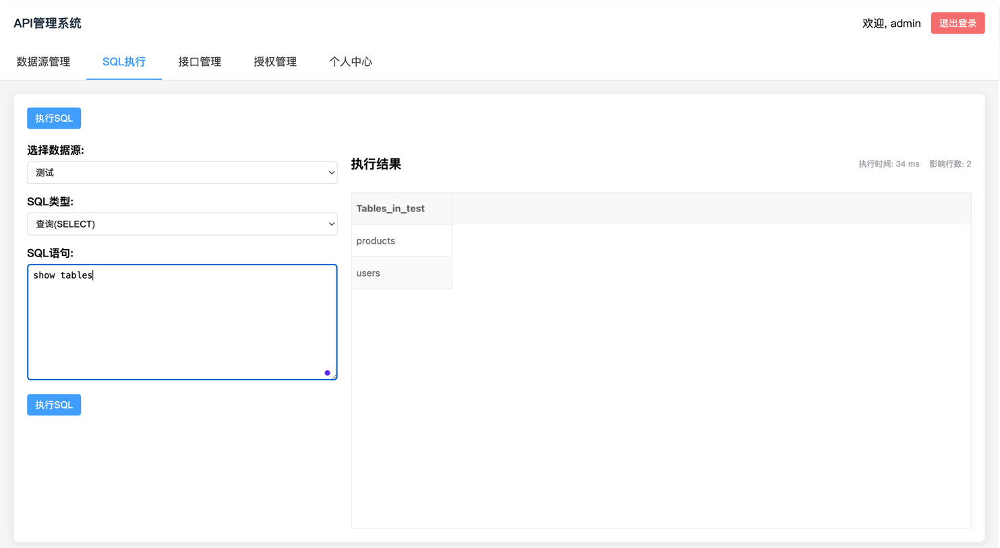
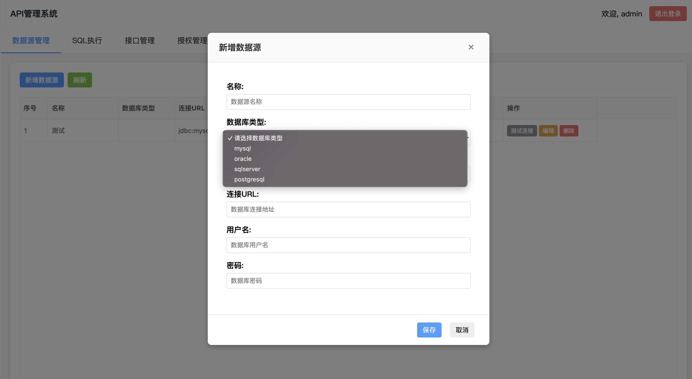
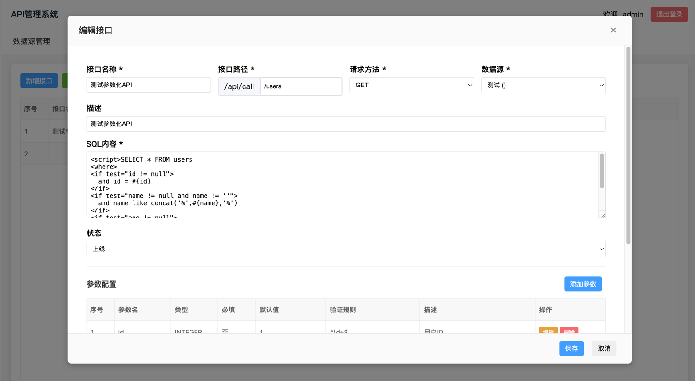

# API数据源管理平台

一个基于Spring Boot和Vue.js的全栈API数据源管理平台，支持多数据源管理和动态SQL执行，提供可视化的API配置和执行功能。

## 项目概述

本项目旨在提供一个统一的数据源管理平台，允许用户配置多种数据库作为数据源，并通过可视化界面创建和管理API接口。平台支持MyBatis风格的动态SQL编写，提供参数化查询功能，确保数据访问的安全性。

## 主要功能

### 后端功能
- **多数据源管理**：支持配置多种数据库（MySQL、PostgreSQL、SQL Server等）作为数据源
- **API接口管理**：提供API的创建、编辑、删除和上下线管理功能
- **动态SQL执行**：支持MyBatis风格的动态SQL编写，包括`<if>`、`<where>`、`<set>`等标签
- **参数化查询**：防止SQL注入，支持参数验证和类型转换
- **权限管理**：集成JWT认证和授权管理模块

### 前端功能
- **数据源配置**：可视化配置和管理数据源
- **API管理**：创建、编辑和管理API接口，集成参数配置
- **SQL执行**：在线执行SQL语句并查看结果
- **用户界面**：基于Vue.js和VXETable的现代化用户界面

## 技术栈

### 后端
- **框架**：Spring Boot 2.7+
- **ORM**：MyBatis-Plus
- **数据库**：MySQL、PostgreSQL、SQL Server等多种数据库
- **连接池**：HikariCP
- **安全**：JWT认证
- **JSON处理**：FastJSON

### 前端
- **框架**：Vue.js 3.x
- **构建工具**：Vite
- **UI组件**：VXETable
- **HTTP客户端**：Axios

## 系统架构

```
┌─────────────────┐    ┌──────────────────┐    ┌─────────────────┐
│   前端界面      │◄──►│   后端服务       │◄──►│   数据源集群    │
│                 │    │                  │    │                 │
│ - Vue.js 3      │    │ - Spring Boot    │    │ - MySQL         │
│ - Vite          │    │ - MyBatis-Plus   │    │ - PostgreSQL    │
│ - VXETable      │    │ - HikariCP       │    │ - SQL Server    │
│ - Axios         │    │ - JWT            │    │ - 其他JDBC DB   │
└─────────────────┘    └──────────────────┘    └─────────────────┘
```

## 部分截图





## 快速开始

### 环境要求
- JDK 8+
- Maven 3.6+
- Node.js 14+
- MySQL 5.7+

### 后端启动

1. 克隆项目
```bash
git clone <repository-url>
cd api
```

2. 配置数据库连接（application.properties）
```properties
spring.datasource.url=jdbc:mysql://localhost:3306/api_platform?useSSL=false&serverTimezone=UTC
spring.datasource.username=root
spring.datasource.password=your_password
```

3. 启动后端服务
```bash
./mvnw spring-boot:run
```

### 前端启动

1. 进入前端目录
```bash
cd frontend
```

2. 安装依赖
```bash
npm install
```

3. 启动前端服务
```bash
npm run dev
```

## 使用说明

### 1. 数据源管理
1. 登录系统后进入数据源管理页面
2. 点击"新增数据源"按钮
3. 配置数据源信息（名称、URL、用户名、密码等）
4. 测试连接并保存

### 2. API管理
1. 进入API管理页面
2. 点击"新增API"按钮
3. 配置API基本信息（名称、路径、方法、数据源）
4. 编写SQL语句，支持MyBatis动态标签
5. 配置API参数（参数名、类型、是否必填等）
6. 保存并上线API

### 3. API执行
1. 进入执行列表页面
2. 选择数据源和输入SQL
3. 执行SQL并查看结果

## API接口规范

### 数据源相关
- `GET /api/datasource/list` - 获取数据源列表
- `POST /api/datasource/save` - 保存数据源
- `DELETE /api/datasource/delete/{id}` - 删除数据源

### API管理相关
- `GET /api/management/apis` - 获取API列表
- `POST /api/management/api` - 保存API
- `DELETE /api/management/api/{id}` - 删除API
- `PUT /api/management/api/{id}/status` - 更新API状态

### API执行相关
- `GET/POST/PUT/DELETE /api/call/{path}` - 执行动态API

## 安全特性

- **SQL注入防护**：使用参数化查询防止SQL注入
- **身份认证**：JWT令牌认证
- **权限控制**：基于角色的访问控制
- **参数验证**：输入参数类型和格式验证

## 部署

### 生产环境部署
1. 打包后端应用
```bash
./mvn clean package -DskipTests
```

2. 运行打包后的JAR文件
```bash
java -jar target/api-0.0.1-SNAPSHOT.jar
```

## 贡献

欢迎提交Issue和Pull Request来帮助改进项目。

## 许可证

[MIT License](LICENSE)